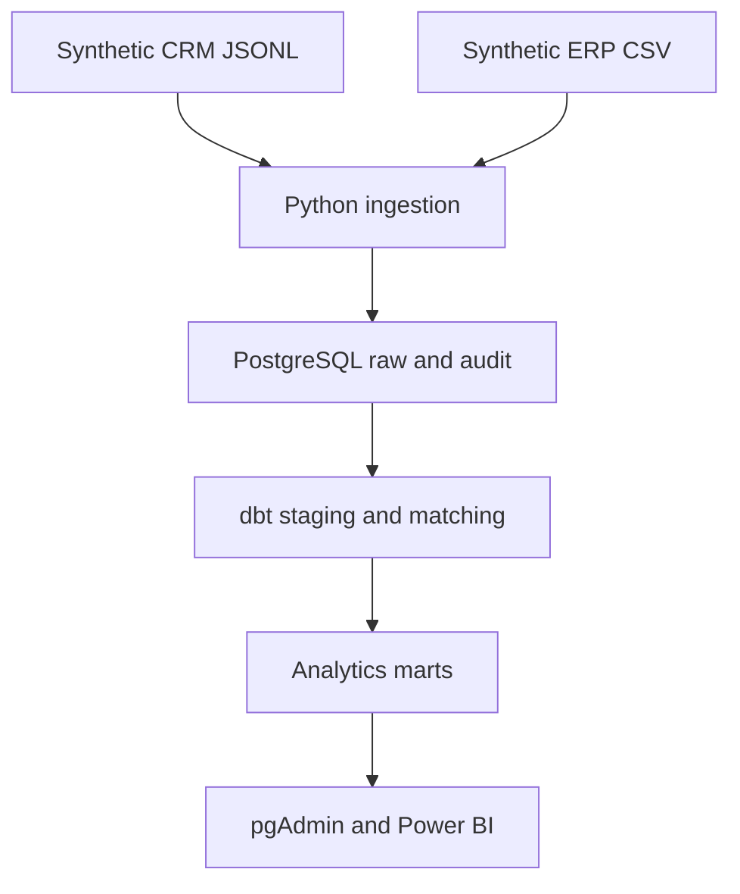
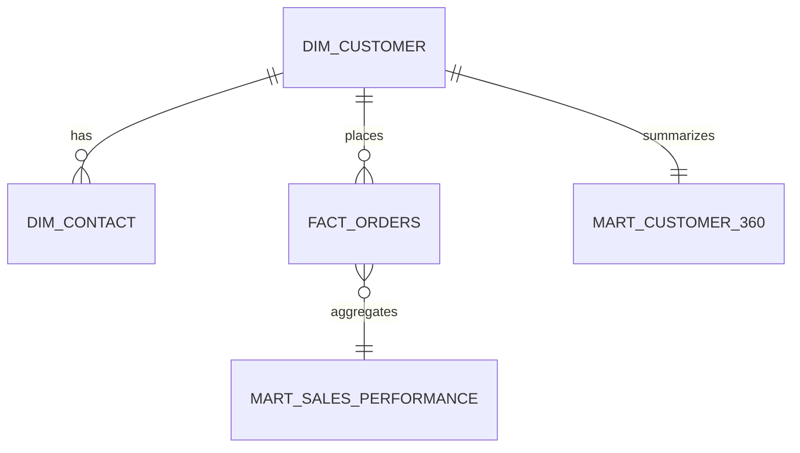

# Sales & CRM Analytics Pipeline

**Python | PostgreSQL | dbt | Docker | pytest | GitHub Actions**

This project builds a reproducible analytics pipeline that combines synthetic CRM and ERP data, validates incoming records, resolves customer identities, and publishes tested customer and sales marts.

It is modeled after a realistic sales-data problem: CRM companies and contacts do not always align cleanly with customers and orders in the operational system, but reporting still requires one trusted customer view.

## Business problem

Sales reporting depends on multiple operational systems:

- The CRM contains companies, contacts, account owners, and engagement context.
- The ERP contains customers, orders, products, statuses, and revenue.
- Identifiers are incomplete, names are formatted differently, records change over time, and bad source rows should not silently enter reporting.

The pipeline creates a controlled path from those source extracts to Power BI-ready PostgreSQL tables.

## Architecture



## What this project demonstrates

- deterministic synthetic data generation
- multi-source batch ingestion
- incremental and late-arriving records
- idempotent reruns and duplicate prevention
- raw-data traceability with batch and file metadata
- invalid-record quarantine with rejection reasons
- latest-record staging logic
- explainable CRM-to-ERP identity matching
- dimensional modeling and reporting marts
- automated dbt and Python tests
- continuous integration against PostgreSQL

## Synthetic source data

The generator creates three batches that simulate files arriving on different days.

| Source | Format | Example contents |
|---|---|---|
| CRM companies | JSON Lines | company identity, domain, location, owner, optional ERP ID |
| CRM contacts | JSON Lines | contact identity, email, company association, job title |
| ERP customers | CSV | customer identity, canonical company name, address, active status |
| ERP orders | CSV | order date, product line, status, customer, amount |

The default run generates:

- 500 CRM companies and ERP customers
- 1,200 CRM contacts
- 10,000 ERP orders
- company-name variations and missing cross-system IDs
- updated CRM owner assignments
- duplicate file deliveries
- late-arriving order dates
- invalid emails and order amounts for quarantine testing

All records are synthetic and generated locally. No employer or customer data is included.

With the default seed, the source validation is repeatable:

| Validation result | Records |
|---|---:|
| Valid source versions loaded on the first run | 12,228 |
| Exact duplicate deliveries ignored | 20 |
| Invalid records sent to quarantine | 24 |
| dbt models in the transformation graph | 11 |
| Automated dbt tests | 40 |

## Pipeline layers

| Layer | Schema | Responsibility |
|---|---|---|
| Audit | `audit` | Pipeline runs, counts, failures, and quarantined records |
| Raw | `raw` | Source-aligned records with ingestion metadata and record hashes |
| Staging | `staging` | Latest valid records with standardized names, domains, and fields |
| Intermediate | `intermediate` | CRM-to-ERP identity matches with methods and confidence scores |
| Analytics | `analytics` | Conformed dimensions, facts, and reporting marts |

## Customer matching rules

Version one uses deterministic, explainable matching rules:

| Priority | Rule | Confidence |
|---:|---|---:|
| 1 | CRM ERP ID equals ERP customer ID | 100 |
| 2 | Normalized CRM domain equals ERP domain | 90 |
| 3 | Normalized company name and state both match | 85 |
| 4 | No accepted match | 0 |

Each accepted match retains its method and confidence score. This makes the result auditable and avoids presenting fuzzy similarity as certainty.

## Analytics model



Published tables:

- `analytics.dim_customer`
- `analytics.dim_contact`
- `analytics.fact_orders`
- `analytics.mart_customer_360`
- `analytics.mart_sales_performance`
- `analytics.mart_data_quality_summary`

## Prerequisites

- Python 3.11 or newer
- Docker Desktop
- pgAdmin 4
- Git

## Quick start on Windows

Run these commands from the `Sales CRM Analytics Pipeline` directory in PowerShell.

### 1. Create the local environment file

```powershell
Copy-Item .env.example .env
```

The included values are local development credentials only. Do not reuse them for a deployed database.

### 2. Create and activate a Python environment

```powershell
python -m venv .venv
.\.venv\Scripts\Activate.ps1
python -m pip install --upgrade pip
pip install -e ".[dev]"
```

### 3. Start PostgreSQL

```powershell
docker compose up -d
docker compose ps
```

Docker creates the PostgreSQL instance, database, user, and persistent volume. pgAdmin is used to register and inspect that server; pgAdmin does not create the Docker database itself.

### 4. Run the complete pipeline

```powershell
python -m sales_crm_pipeline run
```

This command:

1. Recreates the deterministic synthetic source batches.
2. Creates the PostgreSQL schemas and raw tables when needed.
3. Loads valid records and quarantines invalid records.
4. Prevents exact source duplicates from loading twice.
5. Runs every dbt model and data-quality test.

The command is safe to rerun. Existing record hashes prevent exact duplicates while newer source versions remain available to the staging layer.

## Register the server in pgAdmin 4

After `docker compose up -d` reports a healthy database:

1. Open pgAdmin 4.
2. Right-click **Servers** and choose **Register > Server**.
3. Enter the following values.

### General tab

| Setting | Value |
|---|---|
| Name | `Sales CRM Analytics Pipeline` |

### Connection tab

| Setting | Value |
|---|---|
| Host name/address | `localhost` |
| Port | `55432` |
| Maintenance database | `sales_crm` |
| Username | `portfolio_user` |
| Password | `portfolio_dev_password` |
| Save password | Enabled for local development |

The connection values come from `.env`. If you change them there, use the updated values in pgAdmin.

After connecting, expand:

```text
Servers
└── Sales CRM Analytics Pipeline
    └── Databases
        └── sales_crm
            └── Schemas
                ├── audit
                ├── raw
                ├── staging
                ├── intermediate
                └── analytics
```

## Useful pgAdmin queries

Review the latest pipeline run:

```sql
select *
from audit.pipeline_runs
order by started_at desc;
```

Review rejected records and reasons:

```sql
select source_name, rejection_reason, count(*) as rejected_records
from audit.rejected_records
group by source_name, rejection_reason
order by rejected_records desc;
```

Review matching coverage:

```sql
select match_method, match_confidence, count(*) as customers
from analytics.dim_customer
group by match_method, match_confidence
order by match_confidence desc;
```

Query the Power BI-ready sales mart:

```sql
select *
from analytics.mart_sales_performance
order by order_month desc, completed_revenue desc;
```

## Individual commands

Generate source data without loading it:

```powershell
python -m sales_crm_pipeline generate --overwrite
```

Load already generated batches:

```powershell
python -m sales_crm_pipeline load
```

Run only dbt transformations and tests:

```powershell
dbt build --profiles-dir .
```

Run Python tests and quality checks:

```powershell
pytest
ruff check src tests
```

Generate dbt lineage documentation:

```powershell
dbt docs generate --profiles-dir .
dbt docs serve --profiles-dir .
```

## Data-quality controls

- Required identifiers and fields are validated before loading.
- Email addresses must pass a basic structural validation.
- States must use two-letter abbreviations.
- Order dates must be valid ISO dates.
- Order amounts must be numeric and greater than zero.
- Invalid rows retain their source payload and rejection reason.
- Exact source duplicates are blocked by source ID and record hash.
- dbt tests enforce uniqueness, completeness, accepted values, and relationships.
- GitHub Actions runs Python checks and the complete PostgreSQL/dbt build.

## Repository structure

```text
Sales CRM Analytics Pipeline/
├── README.md
├── docker-compose.yml
├── pyproject.toml
├── dbt_project.yml
├── profiles.yml
├── data/generated/
├── macros/
├── models/
│   ├── staging/
│   ├── intermediate/
│   └── analytics/
├── sql/
│   └── 001_raw_schema.sql
├── src/sales_crm_pipeline/
└── tests/
```

## Design decisions

- **PostgreSQL instead of an embedded database:** This mirrors the relational environment used by many analytics teams and supports direct pgAdmin and Power BI connections.
- **Docker for reproducibility:** The database version and local port are controlled without requiring a machine-wide PostgreSQL installation.
- **dbt for transformation:** Business logic, lineage, tests, and documentation live with the SQL models.
- **Deterministic synthetic data:** The same seed recreates the same source records and makes test results repeatable.
- **Transparent matching:** Deterministic rules are easier to validate and explain than an opaque matching score.
- **Generated data is not committed:** Reviewers can recreate it without adding large source files to Git.

## Limitations and next steps

- Version one uses local batch files rather than a live HubSpot or ERP API.
- Identity resolution uses deterministic rules; fuzzy matching and manual-review queues are future extensions.
- The project does not yet preserve full Type 2 history for customer-owner changes.
- Docker and PostgreSQL must be available to run the integration pipeline locally.
- The marts are Power BI-ready, but a dedicated dashboard is not included in version one.
