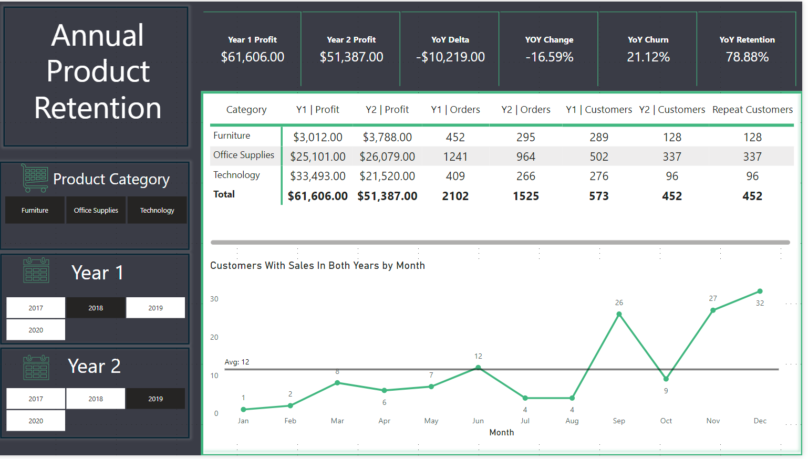
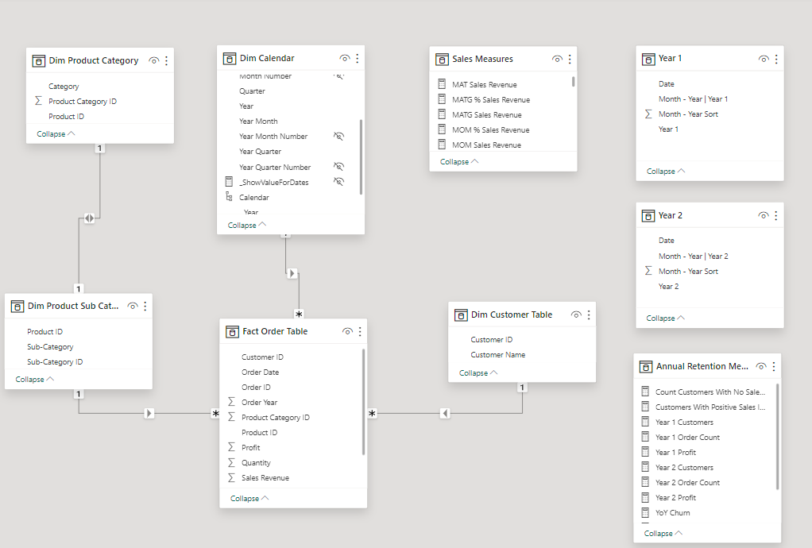

# Annual Product & Customer Retention Analytics

**Power BI | DAX | Customer Retention | Product Analysis | Semantic Modeling**

[View the full report](./Annual%20Product%20%26%20Customer%20Retention%20Analytics%20-%202026.pdf)



## Business problem

Leadership needs to know whether customers active in one year continue purchasing in a later year, how that retention changes by product category, and whether customer continuity translates into stable sales performance.

This Power BI report compares two user-selected years and brings customer retention, churn, profit, and order activity into one interactive view. The portfolio dataset is used for demonstration and does not contain production company data.

## Questions answered

- How many Year 1 customers also purchased in Year 2?
- What percentage of the original customer base was retained or churned?
- How did profit and order volume change between the selected years?
- Which product categories gained or lost profit?
- During which months were repeat customers most active?

## Why this remains a separate Power BI project

This report and the [Python cohort analysis](../../Data%20Projects%20-%20Using%20Python/Cohort%20Retention%20Analysis/) examine retention from different analytical perspectives.

| Project | Retention lens | Primary value |
|---|---|---|
| Power BI annual retention | Customer overlap between two selected years, with product filters | Interactive monitoring, reusable DAX, semantic modeling, stakeholder reporting |
| Python cohort analysis | Customer activity by acquisition cohort and months since first purchase | Cohort construction, lifecycle analysis, exploratory validation, analytical methodology |

Keeping both projects shows that I can calculate and communicate retention in code as well as operationalize it in a business intelligence report.

## Dashboard design

The report combines:

- Year 1 and Year 2 selectors
- Product-category navigation
- Profit, change, churn, and retention KPI cards
- Category-level profit, order, and customer comparisons
- Monthly repeat-customer activity

The layout allows a user to begin with the overall retention result and then filter to a category or change the comparison years without rebuilding the analysis.

## Data model



The model uses a fact-centered design with a snowflaked product hierarchy and disconnected selection tables:

- **Fact Order Table:** customer, order, product, quantity, revenue, and profit activity
- **Dim Customer Table:** customer identifiers and names
- **Dim Calendar:** date attributes used for time-based reporting
- **Dim Product Sub Category:** product and subcategory attributes connected to the fact table
- **Dim Product Category:** category attributes connected through the subcategory dimension
- **Year 1 and Year 2:** disconnected tables used to capture comparison-year selections
- **Annual Retention Measures:** dedicated table for retention, churn, customer, order, and profit measures
- **Sales Measures:** dedicated table for reusable sales calculations

Disconnected year tables let users choose two independent comparison periods. DAX then applies those selections to the order fact table rather than relying on a single calendar filter context.

## Metric definitions

| Metric | Definition |
|---|---|
| Year 1 Customers | Distinct customers with positive sales in the selected Year 1 |
| Repeat Customers | Customers with positive sales in both selected years |
| Customers With No Sales in Year 2 | Year 1 customers who do not appear in the repeat-customer set |
| Retention Rate | Repeat Customers divided by Year 1 Customers |
| Churn Rate | One minus the Retention Rate |
| Year 1 / Year 2 Profit | Profit generated in each selected year |
| YoY Profit Delta | Year 2 Profit minus Year 1 Profit |
| YoY Profit Change | Profit delta divided by Year 1 Profit |

## Selected findings from the report snapshot

- **452 of 573 Year 1 customers** purchased again in Year 2, producing a **78.88% retention rate**.
- The corresponding churn rate was **21.12%**, representing 121 Year 1 customers who did not return.
- Profit declined from **$61,606 to $51,387**, a decrease of **$10,219 or 16.59%**.
- Orders declined from **2,102 to 1,525**, a reduction of **577 orders or 27.45%**.
- Technology profit fell from **$33,493 to $21,520**, while Furniture and Office Supplies increased profit between the selected years.
- Repeat-customer activity in the selected view was highest in December, November, and September.

The snapshot shows that relatively strong customer retention can coexist with lower profit and order volume. Retention should therefore be evaluated alongside purchase frequency, product mix, and customer value rather than treated as a complete performance measure on its own.

## Selected DAX

### Customers with positive sales in both years

```DAX
Customers With Positive Sales In Both Years =
VAR SelectedYear1 = SELECTEDVALUE('Year 1'[Year 1])
VAR SelectedYear2 = SELECTEDVALUE('Year 2'[Year 2])
VAR CustomersInYear1 =
    CALCULATETABLE(
        VALUES('Fact Order Table'[Customer ID]),
        'Fact Order Table'[Order Year] = SelectedYear1,
        'Fact Order Table'[Sales Revenue] > 0
    )
VAR CustomersInYear2 =
    CALCULATETABLE(
        VALUES('Fact Order Table'[Customer ID]),
        'Fact Order Table'[Order Year] = SelectedYear2,
        'Fact Order Table'[Sales Revenue] > 0
    )
RETURN
    IF(
        SelectedYear2 <= SelectedYear1,
        BLANK(),
        COUNTROWS(INTERSECT(CustomersInYear1, CustomersInYear2))
    )
```

### Retention rate

```DAX
YoY Retention =
DIVIDE(
    [Customers With Positive Sales In Both Years],
    [Year 1 Customers]
)
```

### Churn rate

```DAX
YoY Churn =
IF(
    ISBLANK([YoY Retention]),
    BLANK(),
    1 - [YoY Retention]
)
```

### Customers not retained

```DAX
Count Customers With No Sales In Year 2 =
VAR RepeatCustomers = [Customers With Positive Sales In Both Years]
RETURN
    IF(
        ISBLANK(RepeatCustomers),
        BLANK(),
        [Year 1 Customers] - RepeatCustomers
    )
```

## Business use

The report supports several follow-up actions:

- Identify product categories where retained-customer activity is weakening.
- Build outreach lists for customers who purchased in Year 1 but not Year 2.
- Separate customer retention from order-frequency and profit trends.
- Monitor whether product-level improvements are driven by more customers, more orders, or greater value per order.

## Design decisions

- Used independent year selectors so users can compare nonconsecutive periods when needed.
- Used `INTERSECT` to calculate repeat customers from two explicitly defined customer sets.
- Required positive sales so zero-value activity does not count as customer retention.
- Kept retention and commercial KPIs on the same page to prevent an isolated retention rate from hiding declining orders or profit.
- Added product-category filtering so overall retention can be decomposed into actionable segments.

## Limitations and next improvements

- The PDF and screenshots are static; the year and category controls are interactive only in Power BI.
- The PBIX file and source dataset are not included in this repository.
- Annual retention does not show when within the year a customer returned or how long the customer remained inactive.
- The current report focuses on retained versus non-retained customers; a future version could separate new, retained, reactivated, and churned lifecycle states.
- The dashboard snapshot includes both a Year 2 customer column and a Repeat Customers column. The clearer production design would label the intersected population only as Repeat Customers and reserve Year 2 Customers for all active customers in Year 2.

## Project files

```text
Annual Product & Customer Retention Analytics - 2026/
├── README.md
├── Annual Product & Customer Retention Analytics - 2026.pdf
└── images/
    ├── annual-retention-dashboard.png
    └── data-model.png
```
