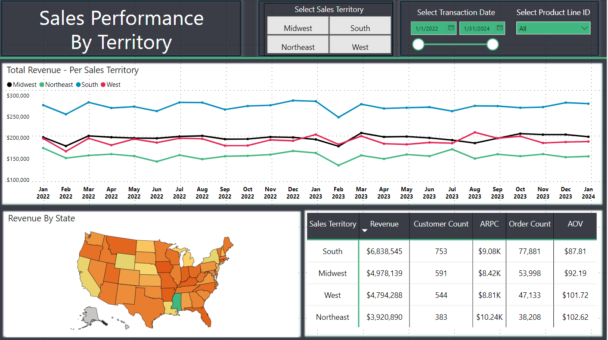
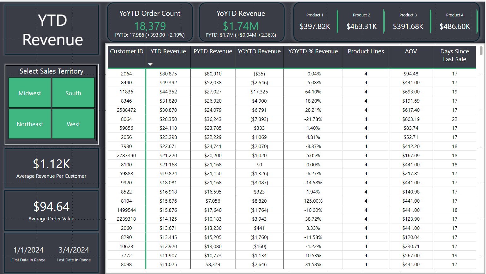
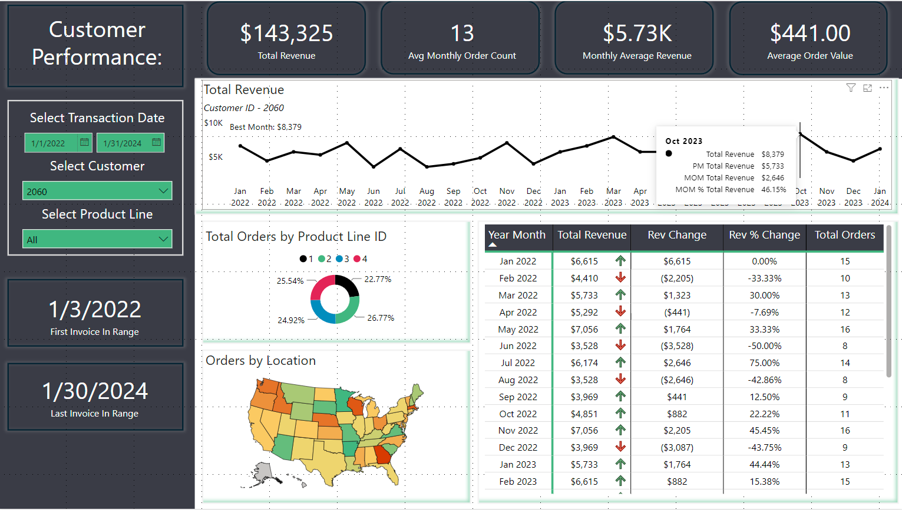
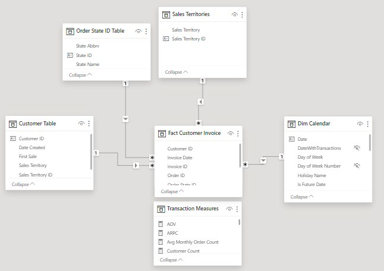

# Sales Performance & Territory Analytics

**Power BI | DAX | Star Schema | Sales Analytics | Time Intelligence**

[View the full report](./Sales%20Performance%20%26%20Territory%20Analytics%20-%202026.pdf)



## Business problem

Sales leaders need a consistent way to monitor revenue and order performance, compare territories, and investigate individual customer trends. This report turns invoice-level activity into three connected analytical views for year-to-date monitoring, territory comparison, and customer-level analysis.

The portfolio dataset is simulated. The figures shown here demonstrate the reporting design and analytical logic rather than actual company performance.

## Questions answered

- How are revenue and order volume performing against the prior year-to-date period?
- Which territories lead on revenue, customers, orders, ARPC, and AOV?
- How does an individual customer's revenue change month over month?
- Which product lines and locations contribute to a customer's activity?
- How recently has each customer purchased?

## Dashboard pages

| Page | Purpose | Primary metrics |
|---|---|---|
| YTD Revenue | Monitor current performance against the equivalent prior-year period | Revenue, order count, ARPC, AOV, product revenue, days since last sale |
| Territory Performance | Compare scale and customer value across sales territories | Revenue, customer count, order count, ARPC, AOV |
| Customer Analysis | Investigate monthly performance for a selected customer | Revenue, monthly orders, monthly average revenue, AOV, month-over-month change |

### YTD revenue



The page combines high-level year-to-date KPIs with customer-level detail. Territory controls allow a leader to move from the company view to a specific region without changing the underlying metric definitions.

### Territory performance


The territory view separates scale from customer value. Revenue and order volume show the size of each region, while ARPC and AOV show how much value is generated per customer and per transaction.

### Customer analysis



The customer page supports account-level investigation with date, customer, and product filters. Dynamic tooltips add previous-month revenue, month-over-month change, and month-over-month percentage change without overcrowding the main trend chart.

## Data model



The semantic model follows a star-schema design:

- **Fact Customer Invoice:** invoice-level customer, order, product, date, and revenue activity
- **Customer Table:** customer attributes, first-sale date, and assigned territory
- **Order State ID Table:** state-level geographic attributes
- **Sales Territories:** territory definitions
- **Dim Calendar:** date attributes and time-intelligence support
- **Transaction Measures:** disconnected measure table used to organize DAX measures

One-to-many relationships filter the invoice fact table from the customer, territory, state, and calendar dimensions. Keeping measures in a dedicated table makes the model easier to navigate and maintain.

## Metric definitions

| Metric | Definition |
|---|---|
| Total Revenue | Sum of invoice revenue in the active filter context |
| Total Orders | Distinct order count in the active filter context |
| Customer Count | Distinct customers with invoice activity |
| AOV | Total Revenue divided by Total Orders |
| ARPC | Total Revenue divided by Customer Count |
| YTD Revenue | Revenue from the beginning of the selected year through the latest selected date |
| Prior YTD Revenue | Revenue through the equivalent date in the prior year |
| MoM Revenue Change | Current-period revenue minus previous-month revenue |
| Days Since Last Sale | Days between the reporting date and a customer's most recent sale |

## Selected findings from the report snapshots

- The YTD view shows **$1.74M in revenue**, up **2.36%** from the equivalent prior-year period.
- YTD order count reached **18,379**, up **2.19%** from 17,986.
- In the territory comparison, the **South** generated the most revenue at **$6.84M** and the most orders at **77,881**.
- The **Northeast** had the smallest customer base in the view but the highest ARPC at **$10.24K** and the highest AOV at **$102.62**.
- Together, the territory metrics show why revenue alone is incomplete: the highest-volume region is not the region with the highest value per customer or order.

These findings describe the selected report states shown in the screenshots. They are not presented as production business results.

## Selected DAX

### Average order value

```DAX
AOV =
COALESCE(
    DIVIDE([Total Revenue], [Total Orders]),
    0
)
```

### Average revenue per customer

```DAX
ARPC =
COALESCE(
    DIVIDE([Total Revenue], [Customer Count]),
    0
)
```

### Year-to-date revenue

```DAX
YTD Total Revenue =
COALESCE(
    CALCULATE(
        [Total Revenue],
        DATESYTD('Dim Calendar'[Date])
    ),
    0
)
```

### Month-over-month revenue change

```DAX
MOM Total Revenue =
VAR CurrentPeriod = [Total Revenue]
VAR PreviousPeriod = [PM Total Revenue]
RETURN
    COALESCE(
        IF(
            NOT ISBLANK(CurrentPeriod)
                && NOT ISBLANK(PreviousPeriod),
            CurrentPeriod - PreviousPeriod
        ),
        0
    )
```

```DAX
MOM % Total Revenue =
COALESCE(
    DIVIDE([MOM Total Revenue], [PM Total Revenue]),
    0
)
```

## Design decisions

- Used a star schema to keep filter behavior predictable and measures reusable.
- Used a dedicated calendar dimension for YTD, prior-period, and month-over-month calculations.
- Kept volume metrics and value metrics together so large territories are not automatically treated as the most efficient.
- Added customer and product filters for guided drill-down instead of creating separate static reports.
- Used dynamic subtitles and tooltips to provide context without adding unnecessary visuals.

## Limitations

- The dataset is simulated and the screenshots represent selected report states.
- The PDF and screenshots are static; slicers and tooltips are interactive only in Power BI.
- The PBIX file and source dataset are not included in this repository.
- The analysis is descriptive. It identifies performance differences but does not establish why those differences occurred.

## Project files

```text
Sales Performance & Territory Analytics - 2026/
├── README.md
├── Sales Performance & Territory Analytics - 2026.pdf
└── images/
    ├── customer-analysis-dashboard.png
    ├── data-model.png
    ├── territory-performance-dashboard.png
    └── ytd-revenue-dashboard.png
```
