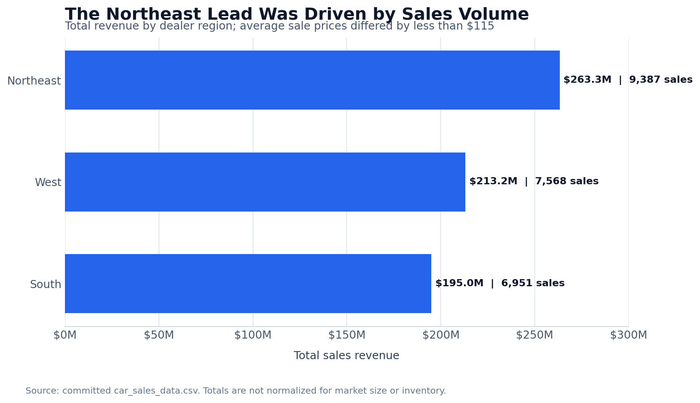

# Car Sales Performance Analysis

**Python | pandas | Matplotlib | Seaborn | Sales analytics**

This project analyzes vehicle transactions to identify the regions, selling periods, manufacturers, and models contributing most to sales performance. It separates transaction volume from average selling price so high revenue is not automatically interpreted as stronger customer spending.

## Business problem

Sales totals alone do not explain why one market performs better than another. Leadership needs to know whether performance is driven by transaction volume, vehicle price, timing, or product mix before making inventory and promotional decisions.

The analysis answers four questions:

- Which dealer region generates the most revenue, and why?
- Which days and months produce the most transactions?
- Which manufacturers and models sell most frequently?
- Are regional differences driven by volume or average selling price?

## Dataset

This project uses the committed `car_sales_data.csv` transaction file.

| Measure | Value |
|---|---:|
| Analysis period | January 2022–December 2023 |
| Transactions | 23,906 |
| Total sales revenue | $671.5 million |
| Manufacturers | 30 |
| Models | 154 |
| Dealer regions | 3 |

Each row represents one vehicle sale and includes the sale date, manufacturer, model, vehicle attributes, sale price, dealer number, and dealer region.

## Methodology

1. Standardized date and sale-price data types.
2. Checked the dataset for missing values and duplicate rows.
3. Aggregated transactions and revenue by month, weekday, region, manufacturer, and model.
4. Calculated average sale price to separate pricing from volume effects.
5. Ranked manufacturers and manufacturer-model combinations by transaction count.
6. Compared monthly performance and used a three-month moving average to show the broader sales trend.

## Key findings

- **The Northeast led because it sold more vehicles, not because vehicles were more expensive.** It produced **$263.3 million** from **9,387 transactions**, representing about **39.2%** of total revenue and transactions. Its average sale price was **$28,052**, nearly identical to the West and South.
- **The West had the highest average sale price, but only slightly.** Its average was **$28,166**, compared with **$28,059** in the South and **$28,052** in the Northeast. The narrow range does not support a claim that one region had materially stronger spending power.
- **2023 materially outperformed 2022.** Transactions increased **24.6%**, while revenue increased **23.6%**.
- **December 2023 was the strongest month.** It generated **1,921 transactions** and **$54.3 million** in revenue.
- **Tuesday was the strongest weekday.** It accounted for **4,425 transactions** and **$123.3 million** in revenue.
- **Chevrolet led manufacturer volume.** It recorded **1,819 transactions** and **$47.7 million** in revenue. The highest-volume manufacturer-model combination was the **Mitsubishi Diamante** with **418 transactions**.

## Regional sales comparison



| Dealer region | Transactions | Revenue | Average sale price |
|---|---:|---:|---:|
| Northeast | 9,387 | $263.3M | $28,052 |
| West | 7,568 | $213.2M | $28,166 |
| South | 6,951 | $195.0M | $28,059 |

## Business recommendations

- Use transaction volume, not average price, as the starting point for investigating the Northeast's lead.
- Compare inventory availability, dealer coverage, and market size before reallocating budget based on regional totals.
- Review the drivers of 2023 growth to determine whether the increase came from additional inventory, expanded distribution, or stronger demand.
- Align inventory planning with manufacturer-model demand while protecting against overreliance on a single high-volume product.
- Test weekday-specific promotions before treating Tuesday's historical lead as a repeatable behavioral pattern.

## Technical implementation

The notebook demonstrates:

- data-type conversion and quality checks
- `groupby()` and `pivot_table()` aggregations
- monthly and weekday date features
- rolling averages for trend analysis
- regional revenue and transaction comparisons
- manufacturer and model rankings
- Matplotlib and Seaborn visualizations
- business-friendly tabular output with `tabulate`

## Repository structure

```text
Car Sales Analysis - 2026/
├── README.md
├── Jack Cournoyer Car Sales Analysis March 2026.ipynb
├── data/
│   └── car_sales_data.csv
└── images/
    └── revenue-by-region.png
```

## Run the analysis

Open `Jack Cournoyer Car Sales Analysis March 2026.ipynb` from this project directory and run all cells in order. The notebook reads the committed CSV through the relative path `data/car_sales_data.csv`.

Required Python packages:

```text
pandas
numpy
matplotlib
seaborn
tabulate
```

## Limitations

- The original source and license for the committed dataset are not documented in the repository and should be confirmed before reuse.
- Regional totals are not normalized for population, market size, inventory, or dealer capacity.
- The analysis is descriptive and does not explain why sales increased or why a particular weekday performed best.
- Manufacturer and model volume indicate transaction frequency, not profitability or market share.
