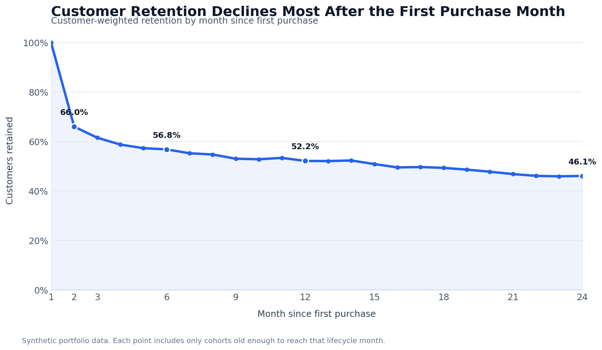

# Customer Retention & Cohort Analysis

**Python | pandas | Seaborn | Customer lifecycle analytics**

This project measures how consistently customers return after their first purchase. It converts transaction-level activity into monthly acquisition cohorts, then compares customer retention at the same point in each cohort's lifecycle.

## Business problem

New-customer counts show acquisition performance, but they do not show whether those customers continue purchasing. A cohort view separates acquisition timing from customer age so retention can be compared on a like-for-like basis.

The analysis answers four questions:

- How quickly does customer activity decline after the first purchase?
- When does the largest drop in retention occur?
- Which acquisition cohorts retain customers most effectively?
- Where should a retention team focus its follow-up efforts?

## Dataset

This project uses a synthetic sales dataset created for portfolio demonstration. It does not contain customer or employer data.

| Measure | Value |
|---|---:|
| Analysis period | January 2021–December 2023 |
| Unique customers | 3,366 |
| Customer-month records | 45,638 |
| Monthly acquisition cohorts | 36 |

Each row represents one customer's purchasing activity in one month. A customer is considered retained in a given month when they have recorded activity during that month.

## Methodology

1. Converted the monthly activity field to a date.
2. Identified each customer's first active month.
3. Assigned the customer to that acquisition cohort.
4. Calculated the number of months since the customer's first purchase.
5. Counted unique active customers by cohort and lifecycle month.
6. Divided active customers by the cohort's original size to calculate retention.
7. Visualized the resulting cohort matrices as retention heatmaps.

## Key findings

- **The first post-purchase month is the largest retention risk.** Customer-level retention fell from 100% in the acquisition month to **66.0% in Month 2**, a 34.0 percentage-point decline.
- **The decline continued at a slower rate after Month 2.** Retention was **61.6% in Month 3**, **56.8% in Month 6**, and **52.2% in Month 12** among cohorts with enough history to reach each milestone.
- **Earlier cohorts performed better in this simulated dataset.** The 2021 cohorts retained **57.8%** of customers at Month 12, compared with **35.8%** for the 2022 cohorts.
- **The pattern supports earlier intervention.** The steepest loss happens before the second active month, so onboarding, follow-up, and second-purchase campaigns should be evaluated before longer-term loyalty tactics.

## Retention curve



The curve uses customer-weighted retention. For each lifecycle month, it includes only cohorts old enough to have reached that point.

## Business recommendations

- Track second-purchase conversion as a primary retention KPI.
- Trigger follow-up activity shortly after the first purchase rather than waiting for a customer to become inactive.
- Compare high- and low-retention cohorts by acquisition source, product mix, customer segment, and first-month order frequency.
- Test retention tactics with a control group before attributing changes to a specific campaign.

## Technical implementation

The notebook demonstrates:

- reusable data-loading and cohort-calculation functions
- date conversion and chronological sorting
- `groupby()` and `transform()` for first-purchase logic
- month-index calculations across calendar years
- unique-customer aggregation and pivot tables
- normalized cohort retention matrices
- annual Seaborn heatmaps

## Repository structure

```text
Cohort Retention Analysis/
├── README.md
├── Python Cohort Retention Analysis - 2026.ipynb
├── data/
│   └── Customer Cohort Analysis Raw Data.csv
└── images/
    └── weighted-retention-by-month.png
```

## Run the analysis

Open `Python Cohort Retention Analysis - 2026.ipynb` from this project directory and run all cells in order. The notebook reads the committed CSV through the relative path `data/Customer Cohort Analysis Raw Data.csv`.

Required Python packages:

```text
pandas
numpy
matplotlib
seaborn
tabulate
```

## Limitations

- The dataset is synthetic, so the findings demonstrate the analytical method rather than performance at a real company.
- Retention is based on activity in a specific month; it is not a rolling or cumulative retention measure.
- Recent cohorts have fewer observable lifecycle months, so long-term comparisons exclude cohorts that have not yet reached the relevant milestone.
- The analysis is descriptive and does not establish why one cohort retained better than another.
