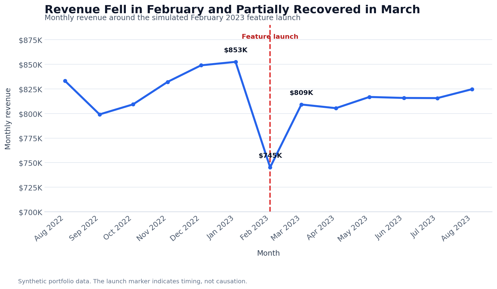

# Website Feature Launch Performance Analysis

**Python | pandas | Matplotlib | Seaborn | KPI validation**

This project evaluates how revenue, customer activity, and order value changed around a simulated website feature launch in February 2023. It is framed as a pre/post performance analysis, not a causal impact study.

## Business problem

A decline after a product launch does not automatically mean the launch caused the decline. Leadership needs a clear view of which metrics changed, whether the movement came from customer volume or order value, and what additional evidence would be required before attributing the result to the feature.

The analysis answers four questions:

- Did monthly revenue change around the launch?
- Were changes driven by customer count, order count, or order value?
- Did performance recover during the six months after launch?
- What can and cannot be concluded from a pre/post comparison?

## Dataset

This project uses a constructed transaction dataset created for portfolio demonstration. It does not contain customer or employer data.

| Measure | Value |
|---|---:|
| Analysis period | August 2022–August 2023 |
| Invoice rows | 112,859 |
| Unique orders | 112,819 |
| Unique customers | 2,083 |
| Total revenue | $10.61 million |
| Simulated launch month | February 2023 |

The 13-month window contains six complete pre-launch months, the launch month, and six complete post-launch months.

## Metric definitions

| Metric | Definition |
|---|---|
| Revenue | Sum of transaction revenue |
| Customers | Distinct customers active during the month |
| Orders | Distinct orders during the month |
| ARPC | Monthly revenue divided by distinct monthly customers |
| AOV | Monthly revenue divided by distinct monthly orders |

## Methodology

1. Converted invoice dates to a consistent date type.
2. Filtered the data to the 13-month analysis window.
3. Checked for missing values and duplicate rows.
4. Aggregated revenue, customers, and orders by month.
5. Calculated ARPC, AOV, month-over-month change, and three-month rolling averages.
6. Compared the six-month pre-launch average with the six-month post-launch average.
7. Separated the launch month's volume changes from its order-value change.

## Key findings

- **Revenue fell sharply in the launch month on a raw monthly basis.** February revenue was **$745,199**, down **12.59%** from January.
- **Most of the monthly decline came from volume.** Orders fell **12.55%** and active customers fell **5.96%**, while AOV was essentially flat at **-0.05%**. ARPC declined **7.05%**.
- **February's shorter calendar materially affects the comparison.** Revenue per calendar day declined only **3.22%** from January, and orders per day declined **3.18%**. This makes the raw monthly decline look more severe than the normalized daily trend.
- **Performance rebounded in March.** Revenue increased **8.58%** and ARPC increased **3.53%** from February, although neither change establishes that customers adapted to the feature.
- **Post-launch averages remained slightly below pre-launch levels.** Average monthly revenue was **$814,571** after launch versus **$829,163** before launch, a **1.76%** difference. Average ARPC was **1.55%** lower and AOV was **1.23%** lower.

## Monthly revenue trend



The launch marker shows timing only. It does not prove that the feature caused the February decline or the later recovery.

## Business recommendations

- Normalize monthly performance by selling days before escalating a launch-related revenue decline.
- Diagnose funnel volume first because order count changed far more than AOV.
- Segment results by customer tenure, acquisition channel, geography, and product line to identify where the decline occurred.
- Use an A/B test, phased rollout, or credible control group for future launches when causal measurement matters.
- Define success metrics and guardrails before launch so the evaluation is not selected after results are known.

## Technical implementation

The notebook demonstrates:

- reusable data-loading and metric functions
- date filtering and monthly aggregation
- distinct customer and order calculations
- revenue, ARPC, and AOV measurement
- month-over-month percentage change
- rolling-average trend lines
- Matplotlib and Seaborn visualizations
- formatted validation tables with `tabulate`

## Repository structure

```text
Website Feature Launch Sales Impact Analysis - 2026/
├── README.md
├── Website Feature Launch Sales Analysis - 2026.ipynb
├── data files/
│   └── transaction_table.csv
└── images/
    └── monthly-revenue-around-launch.png
```

## Run the analysis

Open `Website Feature Launch Sales Analysis - 2026.ipynb` from this project directory and run all cells in order. The notebook reads the committed CSV through the relative path `data files/transaction_table.csv`.

Required Python packages:

```text
pandas
matplotlib
seaborn
plotly
tabulate
```

## Limitations

- The dataset is synthetic, so the findings demonstrate the analytical method rather than a real launch outcome.
- The analysis has no control group and cannot separate the feature from seasonality, marketing, product mix, or other concurrent changes.
- February has fewer calendar days than January, making raw monthly comparisons potentially misleading.
- Customer exposure to the feature is not recorded, so treatment and non-treatment groups cannot be compared.
- The launch date is represented at the month level, which limits analysis of immediate daily behavior.
